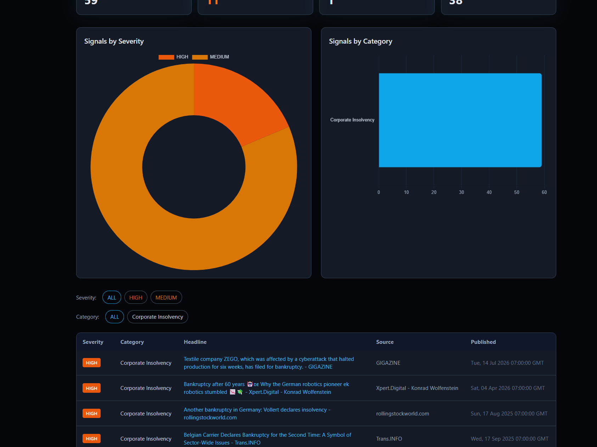

# FOMO — Fear Of Missing Out


A supply chain & logistics **risk radar for the Germany region**, built from public news only.

<br clear="left"/>

<div align="center">

### [**👉 Click here to open the live dashboard**](https://jeevan-0508.github.io/FOMO/)

</div>

FOMO scans public news feeds for signals across six risk categories — cargo theft, missing
trailers / phantom carrier fraud, freight & carrier fraud, corporate insolvency, regulatory /
compliance risk (LkSG), and operational disruption — tags each signal by severity, and renders
everything into a single-page experience: a cinematic intro, an animated landing page explaining
what FOMO does, and a full dashboard with a date picker for scrubbing back through daily
snapshots.

Data refreshes on its own — a scheduled GitHub Action re-runs the scanner every 6 hours and
auto-publishes the update, so the live page reflects "as of the last scan" rather than needing
anyone to run it manually. (A true fetch-on-page-load isn't possible on GitHub Pages: it's a
static host with no server, and the browser can't call Google News directly due to CORS. The
scheduled Action is the closest real equivalent.)

No Amazon-internal data, tools, or systems are used anywhere in this project. Every signal comes
from a public news source (Google News RSS), with the original headline and link preserved so you
can verify it yourself.

## Screenshot

> Run `Run FOMO.bat`, then open `dashboard.html`, take a screenshot, and drop it in
> `screenshots/dashboard.png` — it'll render here automatically.



## Why "FOMO"

The whole point of a risk radar is to make sure you never miss the signal that mattered. FOMO is a
small, deliberate nod to that: it exists so *you* don't have the fear of missing out on the story
that turns into a real problem three weeks later.

## What it does

1. `scanner.py` queries Google News RSS across six categories, scoped loosely to the Germany /
   DACH news edition.
2. Each headline is scored for severity (`low` / `medium` / `high` / `critical`) using a small
   keyword-escalation model per category (e.g. "organised crime", "insolvenz", "ransomware").
3. Results are deduplicated against everything already seen (`data/signals.json`), so re-running
   the scanner only appends genuinely new signals — the tool remembers, it never re-flags the same
   thing twice.
4. `build_dashboard.py` renders `dashboard.html` — KPI cards, a severity donut, a category bar
   chart, and a filterable table of every signal with a live link back to the source article.

## Running it

Requires only Python 3.10+ (standard library only, no pip installs):

```
python scanner.py          # pulls new signals, appends to data/signals.json
python build_dashboard.py  # rebuilds dashboard.html from the current data
```

Then open `dashboard.html` in a browser.

On Windows, double-click `Run FOMO.bat` to do both steps and open the dashboard in one click.

## Current status

The repo ships with a live-pulled starter dataset (`data/signals.json`) so the dashboard isn't
empty on first clone. Run the scanner again from your own machine to pick up fresh signals across
all six categories — results accumulate over time rather than resetting.

## Notes on reliability

Google News RSS silently returns an empty feed (HTTP 200, no `<item>`s) when it throttles a
client, instead of raising an error. `scanner.py` treats an empty result as suspect and retries
with backoff before trusting it as a genuine "nothing found." If you run the scanner many times in
quick succession (e.g. while developing), you may still see a temporary empty result for a
category — that's Google's rate limiting, not a bug, and it clears on its own after a short wait.

## Project structure

```
FOMO/
├── scanner.py            # fetches + scores + dedupes news signals
├── build_dashboard.py    # renders dashboard.html from data/signals.json
├── data/signals.json     # accumulated signal history
├── dashboard.html        # generated dashboard (open this)
├── icons/jk-logo.png     # project logo
├── screenshots/          # drop a dashboard.png here for the README preview
└── Run FOMO.bat          # one-click Windows launcher
```

## Roadmap ideas

- Scheduled runs (cron / Windows Task Scheduler) for a genuinely "always watching" radar
- Slack/email digest of new critical/high signals since the last run
- Region expansion beyond Germany using the same category model
- Optional NLP-based severity scoring instead of keyword escalation

## License

All rights reserved. See `LICENSE`.
